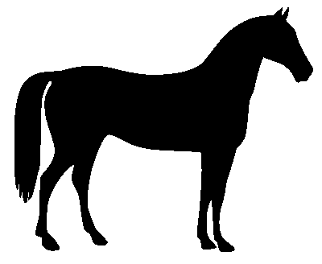
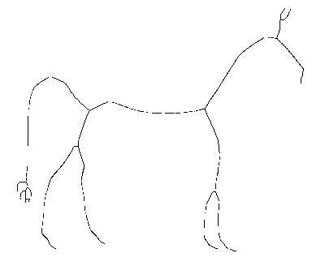

# skeletonide


Skeletonide is a parallel implementaion of Zhang-Suen morphological
thinning algorithm written in Halide-lang. It can be used for fast
skeletonization of binary masks. Can also be run on the GPU.

When you build the project, it generates an ahead-of-time
compiled static library from the halide pipeline. It is then
linked with the caller code to generate a single binary.

Note: The halide pipeline represents a single pass of the
Zhang-Suen method. The iterations have to be handled by the 
caller code - see `spook.cpp` for an example. The number of
iterations is hardcoded right now. It should depend on the 
completion flags returned by the halide pipeline.


## Usage

See `spook.cpp` for an example. The example benchmarks the time 
taken to skeletonize a large image on the GPU. Pipeline code is in
`src/pipeline.cpp`.


## Benchmarks

We get the best performance when it is run on a GPU. The tests are
run on the scikit-image's horse mask, but tiled 10x10 to create a large
(3280, 4000) shaped test image. The time is averaged over 100 runs.

| Implementation                        | CPU (i7-7700HQ) | GPU (GTX 1050m) |
| ------------------------------------- | --------------- | --------------- |
| Scikit-image `morphology.skeletonize` | **2073 ms**     | NA              |
| Skeletonide                           | 3786 ms         | **210 ms**     |

The scheduling of the Halide pipeline can be further tweaked through 
trial-and-error to achieve better CPU times. The slow performance on the CPU
is partly explained by the fact that the pipeline only represents a single pass
of the thinning algorithm. There is significant time penalty in handling the 
iterations from the outside as illustrated in `spook.cpp`.  
However, on the GPU, Skeletonide performs roughly 10x faster than the scikit-image's 
CPU implemetation without major modifications. Not a level playing field, obviously.

The output on the scikit-image's horse mask:

Mask:  
    

Skeleton:  
  

## Build

```sh
mkdir build
cd build
cmake ..
cmake --build .
# this will build the static library and its 
# header in `build/` and a single test binary 
# called `spook` in `skeletonide` - which can
# be run `./spook` to see it in action.
```

## License
MIT License